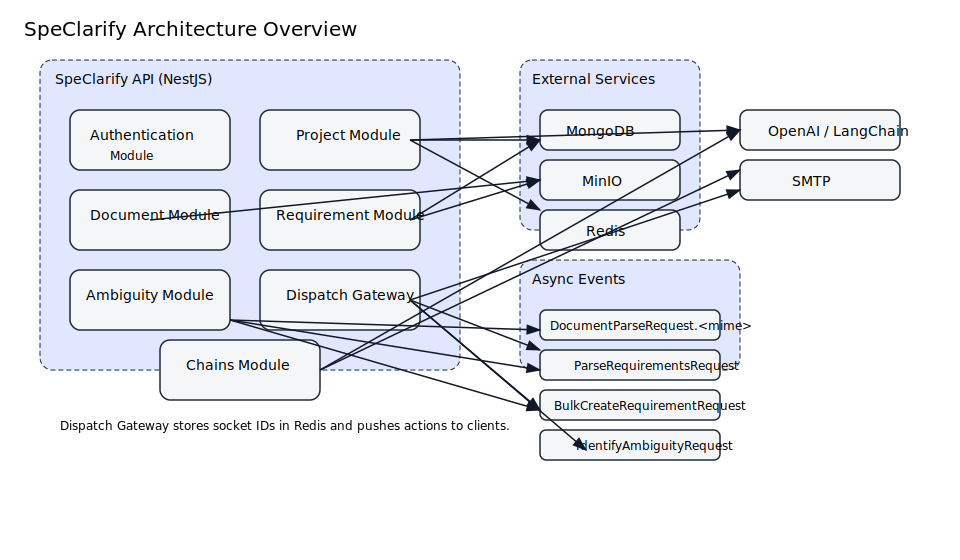
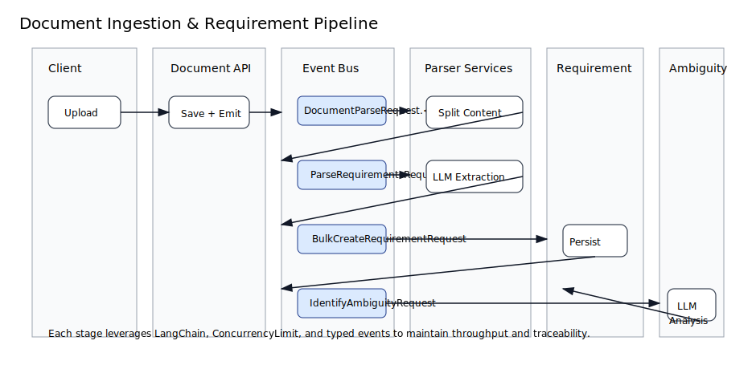
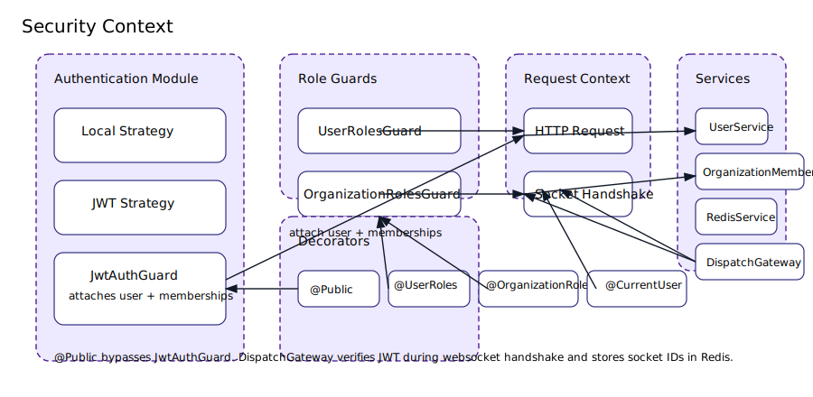

# Architecture

This document summarizes the core building blocks of the SpeClarify backend and explains how data moves through the system.

## High-Level Components

- **API Layer (NestJS):** Modules grouped under `src/modules/**` expose REST endpoints, WebSocket gateways, and background event listeners.
- **MongoDB (Mongoose):** Each domain registers schemas via `MongooseModule.forFeature`; repositories wrap data access and often expose Optional semantics.
- **Redis:** Tracks active websocket sessions and can host other transient data.
- **MinIO:** Stores user avatars, project assets, uploaded documents, and generated exports. `FileService` manages uploads and presigned URLs.
- **LangChain/OpenAI:** LLM-backed pipelines classify, prioritize, and validate requirements.
- **Mailer:** SMTP-backed notifications using Handlebars templates.

## Module Responsibilities

| Module | Responsibility |
| ------ | -------------- |
| Authentication | Local + JWT auth, refresh tokens, verification codes, guard registration |
| Project | Organization-scoped CRUD, MinIO-backed project logos |
| Document | Upload storage, creates `DocumentParseRequest.<mime>` events |
| Document Parser | Mime-specific parsers that split content into LangChain `Document` chunks |
| Requirement | CRUD, XLSX export, orchestrates priority/class/type inference |
| Chains | Centralizes LangChain sequences (priority, classify, parser, ambiguity) |
| Ambiguity | Consumes `IdentifyAmbiguityRequest`, stores reasons/suggestions |
| Dispatch | Socket.IO gateway + Redis presence tracking |
| Communications | Emits emails via `email.send` event |

Additional supporting modules include Invitations, Notifications, Organization (and memberships), Files, ARFF exports, and Redis utilities.

## Event-Driven Document Pipeline

1. **Upload:** `DocumentController` validates uploads and saves blob metadata.
2. **Parse Request:** `DocumentService` emits `DocumentParseRequest.<mime>`.
3. **Parser:** A parser service (`TextParserService`, `PdfParserService`, `ExcelParserService`, `WordParserService`) tokenizes content and emits `ParseRequirementsRequest`.
4. **Requirements Parser:** `RequirementsParserService` orchestrates LLM extraction, deduplication, and validation. Valid entries are wrapped in `BulkCreateRequirementRequest`.
5. **Bulk Create:** `RequirementService` persists requirements, infers type/priority, and emits `IdentifyAmbiguityRequest`.
6. **Ambiguity Check:** `AmbiguityService` runs the ambiguity chain and stores findings.
7. **Downstream Actions:** Notifications, exports, and websockets can react to repository changes.

## Security and Roles

- **Authentication:** Passport local strategy handles login; JWT strategy verifies tokens and attaches full user documents.
- **Guards:** `JwtAuthGuard`, `UserRolesGuard`, and `OrganizationRolesGuard` are registered globally. Decorators `@Public`, `@UserRoles`, and `@OrganizationRoles` control access.
- **Organization Scope:** `OrganizationModule` and `OrganizationMemberModule` enforce membership. Routes accept `:orgPath` and often `:projectPath`.
- **WebSockets:** `DispatchGateway` validates JWTs during Socket.IO handshake and stores session IDs in Redis.

## Data Storage Patterns

- **MongoDB:** Soft relations via ObjectId references (e.g., requirements link to projects). `PageResponse` is used for pagination.
- **MinIO:** Object paths follow `FileType`-driven folder structures (e.g., `organizations/<org>/projects/<project>/documents/<uuid>`).
- **Redis:** Keys follow predictable patterns. Clean up sockets on disconnect and expire stale keys as needed.

## LangChain Strategy

- `LLM.getInstance()` ensures a single chat model configuration for non-ambiguity chains.
- The ambiguity chain instantiates its own `ChatOpenAI` client to widen concurrency.
- `ConcurrencyLimit.getInstance()` throttles high-throughput loops (e.g., validating each requirement).
- `RequirementClassifyChain` builds few-shot prompts using `OpenAIEmbeddings` + `HNSWLib`. Provide representative historical examples when invoking.

## Extending the System

- **New Modules:** Follow the `module/service/repository/controller/schema` pattern and register via `AppModule`.
- **New Events:** Reuse existing naming conventions (`<Domain><Action>Request`) to stay consistent.
- **New LLM Workflows:** Add services to `ChainsModule`, use `ConcurrencyLimit`, and emit domain-specific events.
- **Integrations:** When introducing new external services, surface credentials via `EnvironmentConfig` instead of `process.env` directly.

For developer-specific practices, see [Development Guide](development-guide.md).
